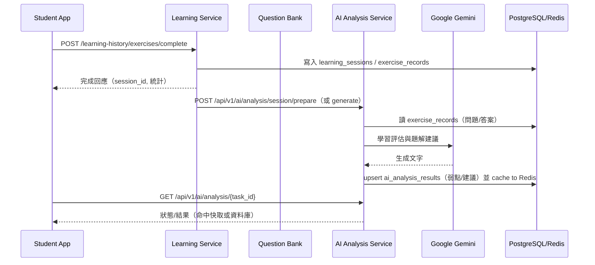
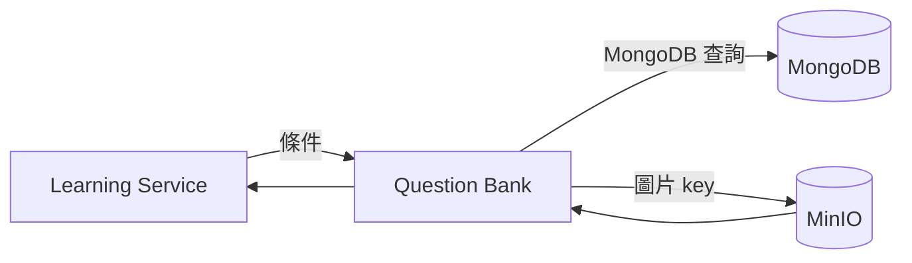
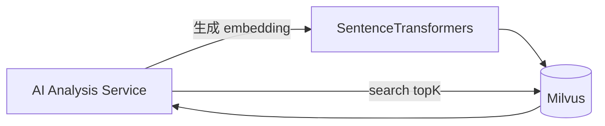

### 後端技術選型與架構總覽（Pyramid）

— TL;DR —

- 目的：以 DDD 思維拆分多服務，支援學習歷程、AI 分析、題庫、通知與家長/教師儀表板等場景。
- 技術主軸：Python 3.11、FastAPI（ASGI, Uvicorn）、PostgreSQL、MongoDB、Redis、RabbitMQ、MinIO、Milvus、Google Gemini、RQ（可選）。
- 選 FastAPI 而非 Flask：高併發與原生 async 支援（ASGI）、型別驗證（Pydantic v2）與較佳吞吐/延遲；Flask 適合輕量同步應用，但在高併發與型別驗證上需要額外擴充。
- 資料流：Student App → Learning Service（寫入 session/records）→ AI Analysis Service（Gemini 推論）→ 回寫結果 → 觸發通知/看板；題目涉及 Question Bank（Mongo/MinIO），相似題使用 Milvus。
- DDD：以 bounded context 劃分服務（Auth、Learning、QuestionBank、AIAnalysis、Notification、ParentDashboard、TeacherManagement、Report），聚合根如 `LearningSession`、`ExerciseRecord`、`User`。
- 成本/風險：多服務部署與資料一致性、外部 AI 速率限制、向量庫依賴；以 Redis/RQ、快取、指數退避、批次任務緩解。

---

## 一、整體架構鳥瞰（What & Where）

- 核心服務（皆使用 FastAPI）：
  - Auth Service：帳號、JWT、關係（家長/學生/教師、班級）。持久層 PostgreSQL。
  - Learning Service：會話/練習紀錄、學習歷史、統計、與 AI 分析協作。持久層 PostgreSQL，亦能連結其他資料源。
  - Question Bank Service：題庫（MongoDB）與題圖（MinIO），搜尋與條件取題。
  - AI Analysis Service：Gemini 推論（弱點分析、題解建議、趨勢分析、非同步任務、Redis/RQ）、Milvus 相似檢索（SentenceTransformers 嵌入）。
  - Notification Service：以 RabbitMQ（規劃中）或背景任務發送通知。
  - Parent Dashboard / Teacher Management / Report Service：匯總跨域資料，提供家長/教師端視圖與報表。

- 關鍵基礎設施：
  - API：FastAPI（ASGI）+ Uvicorn。
  - DB：PostgreSQL（學習記錄、用戶、AI 結果）、MongoDB（題庫）、Redis（快取/任務狀態）。
  - 物件儲存：MinIO（題圖）。
  - 向量庫：Milvus（相似題檢索）。
  - LLM：Google Gemini（`google-generativeai`）。
  - 佇列：RQ（可選）/ RabbitMQ（規劃中）。

---

## 二、FastAPI vs Flask（效能與工程實務對比）

- 併發模型：
  - FastAPI：基於 ASGI（Uvicorn/Starlette），原生 async/await。I/O 密集（DB、HTTP、LLM）情境可顯著提升併發吞吐。
  - Flask：傳統 WSGI，同步為主；要達到等效併發需額外整合（如 gevent、Gunicorn workers）且程式撰寫不若原生 async 直觀。

- 型別與效能：
  - FastAPI：Pydantic v2 驗證（速度優化），自動 OpenAPI 文件、路由依賴注入；在大量 schema 驗證情境下更穩定高效。
  - Flask：輕量彈性強，但表單/JSON 驗證、文件、自動依賴注入需外掛與自管。

- 實務觀察（通用結論，非專案壓測數）：
  - FastAPI 在 I/O 密集服務（DB、外部 API/LLM）下，以 async 節省等待時間，平均延遲更低、資源使用更有效。
  - Flask 可勝任簡單同步 CRUD，但在高併發/大量外部呼叫下須更多工程化（workers、協程/非同步外掛）才能逼近。

- 本案選擇理由：
  - 多服務普遍 I/O 密集（PostgreSQL、MongoDB、MinIO、Gemini、Milvus）。
  - FastAPI 為主線 Python 框架，與 Pydantic v2、Starlette 生態整合緊密。
  - 生成型 AI 與相似檢索工作流程適合 async 與背景任務（RQ/ThreadPool）。

---

## 三、資料流與互動（How）

### 3.1 完成練習 → AI 分析 → 推薦/通知



### 3.2 取題與圖檔



### 3.3 相似題檢索（向量）



---

## 四、設計邏輯（Why & Principles）

- 可維護性與演進：以微服務對齊 bounded context，降低耦合（Question Bank 專注題庫，AI Analysis 專注生成/檢索）。
- 高併發 I/O：FastAPI async + Uvicorn；外部 I/O（Gemini、Mongo、MinIO、Milvus）大量存在。
- 韌性：
  - Redis 快取與任務狀態（避免重算、去重鎖、速率限制）。
  - 指數退避與重試（AI 呼叫）。
  - 批次/背景任務（RQ/ThreadPool）。
- 可觀測性：健康檢查 `/health`、診斷端點、結構化日誌。

---

## 五、DDD 架構對應（Context → Service → Model）

- Bounded Contexts 與聚合根：
  - Auth：`User`、`RefreshToken`、`ParentChildRelation`、`SchoolClass`。
  - Learning：`LearningSession`、`ExerciseRecord`、`UserLearningStats`。
  - QuestionBank：`Question`、`Chapter`、`KnowledgePoint`（Mongo 文件）。
  - AIAnalysis：`AIAnalysisTask`（task 狀態/結果，實作於 `ai_analysis_results` 表 + Redis 快取）。
  - Notification：`NotificationRequest`（聚合）與外部通道整合。
  - ParentDashboard / TeacherManagement / Report：查詢型（Reporting/Read Model）聚合，跨 context 聚合讀取。

- Repository / Service 分層（以 Learning 為例）：
  - Domain Entities：`LearningSession`、`ExerciseRecord`（`src/models/learning_session.py`, `src/models/exercise_record.py`）。
  - Application Services：`ExerciseService`（建立練習、提交答案、完成會話，驅動 AI 協作）。
  - Infrastructure：`utils/database.py`（Session 管理）、`question_bank_client.py`、`ai_analysis_client.py`（防腐層）。

- 防腐層（ACL）：
  - Learning 透過 `ai_analysis_client` 與 AIAnalysis REST API 溝通，屏蔽實作差異（同步/非同步、快取策略）。
  - 對題庫、認證等亦採用 Client 封裝避免直接耦合第三方協定。

---

## 六、實際範本案例（Samples）

### 6.1 完成練習後觸發 AI 分析（非同步）

1) 前端提交完成：

```http
POST /learning-history/exercises/complete
Content-Type: application/json
Authorization: Bearer <JWT>

{
  "session_name": "數學_正負數練習",
  "subject": "數學",
  "grade": "7A",
  "publisher": "南一",
  "exercise_results": [
    {
      "question_id": "MATH-001",
      "subject": "數學",
      "grade": "7A",
      "publisher": "南一",
      "knowledge_points": ["正負數的定義"],
      "question_content": "0 是正數或負數？",
      "answer_choices": {"A":"正數","B":"負數","C":"都不是","D":"最小正數"},
      "user_answer": "B",
      "correct_answer": "C",
      "is_correct": false,
      "score": 0,
      "time_spent": 30
    }
  ],
  "total_time_spent": 300
}
```

2) Learning Service 持久化後，呼叫 AIAnalysis 準備任務：

```http
POST /api/v1/ai/analysis/session/prepare
Content-Type: application/json

{
  "session_id": "<UUID>",
  "skip_existing": true,
  "max_records": 100
}
```

3) 前端查詢任務狀態或直接一次取得結果：

```http
GET /api/v1/ai/analysis/{task_id}

POST /api/v1/ai/analysis/generate
{
  "question": {"grade":"7A","subject":"數學", ...},
  "student_answer": "B",
  "exercise_record_id": "<UUID>"
}
```

回應（精簡）：

```json
{
  "success": true,
  "data": {
    "學生學習狀況評估": "...",
    "題目詳解與教學建議": "..."
  },
  "message": "generated_or_completed",
  "task_id": "..."
}
```

### 6.2 相似題推薦（Milvus + SentenceTransformers）

```http
POST /api/v1/vector-search/search
{
  "query_text": "正負數數線表示",
  "top_k": 5
}
```

回應（示例）：

```json
{
  "similar_questions": [
    {"question_id":"sim_1","similarity_score":0.86,"metadata":{}}
  ],
  "total_count": 5
}
```

### 6.3 DDD 服務內部（AI Analysis 去重與速率限制）

重點：
- Redis key 設計：`ai:v1:analysis:record:{record_id}:latest`（最新任務索引）、`ai:v1:analysis:task:{task_id}`（任務 payload）。
- 去重：`SET NX EX` 鎖避免重複排程；缺快取時回退本機鎖。
- 速率限制：每秒呼叫上限（RPS）以 Redis 計數，回退本機。
- 重試：Gemini 呼叫失敗指數退避。

---

## 七、技術選型的原因（Decision Drivers）

- Python + FastAPI：開發效率高、型別/驗證完善、async 友善、文件自動化。
- PostgreSQL：結構化數據與關聯（學習紀錄、用戶、AI 結果），支援 JSON/擴充。
- MongoDB + MinIO：題庫文件型結構 + 圖片檔案存放，擴展性與成本兼顧。
- Redis：快取、任務狀態、限流與鎖；提升整體體感速度與穩定性。
- Milvus + SentenceTransformers：相似題檢索效能與向量生態成熟。
- Google Gemini：中文教育場景回應品質佳、成本可控。
- RQ / 背景執行：避免同步阻塞，支援批量與可恢復處理。

---

## 八、可營運性與效能（Ops & Perf）

- 併發：Uvicorn workers × async；I/O 密集優先擴張連線池與 worker 數量。
- 快取：AI 結果與查詢摘要放 Redis，減少重算與 DB 壓力。
- 佇列：高峰期以任務列隊平滑外部 API（LLM）呼叫。
- 觀測：/health、/status、結構化日誌；關鍵路徑加計時與告警閥值。

---

## 九、風險與對策（Risks & Mitigations）

- 外部 LLM 不可用或限流：本地快取回退、任務重試、降級為基本建議模板。
- 多服務資料一致性：以查詢模型（Read Model）與最終一致為目標；介面明確與冪等操作。
- 向量庫故障：回退至規則式/題庫相似欄位檢索；或限制推薦數量。

---

## 十、後續演進（Next）

- 細化觀測（Tracing、Metrics、Dashboards）。
- 以事件驅動（RabbitMQ/Kafka）取代部分同步耦合，提升可擴展性。
- 強化資料治理（模式版控、遷移、資料品質校驗、脫敏）。


